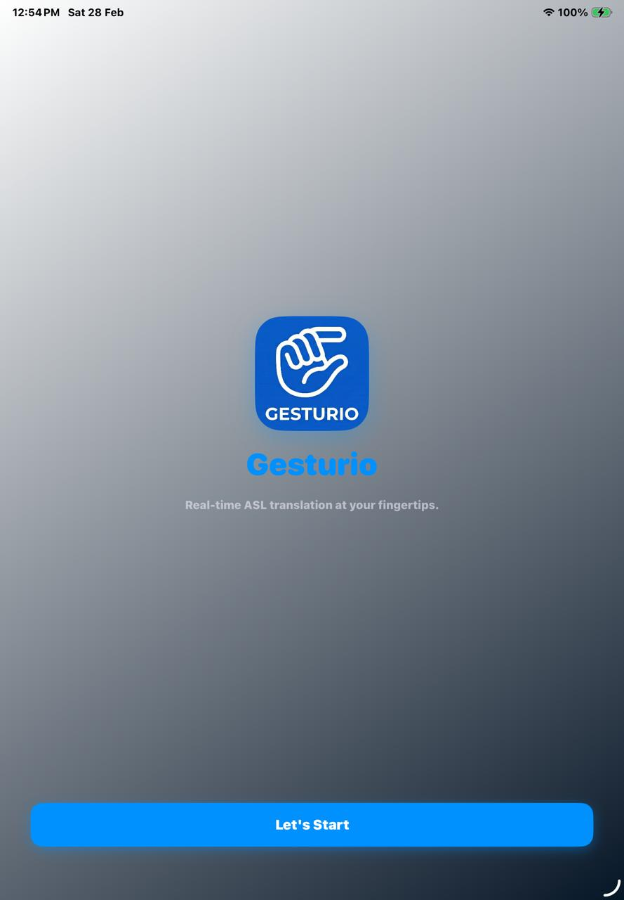
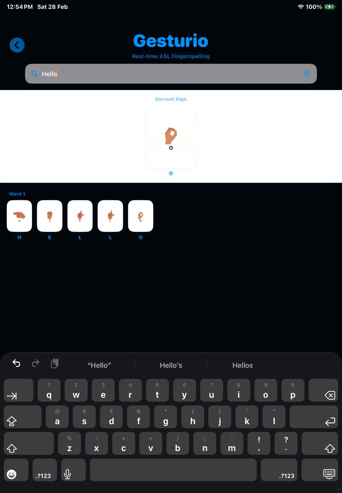
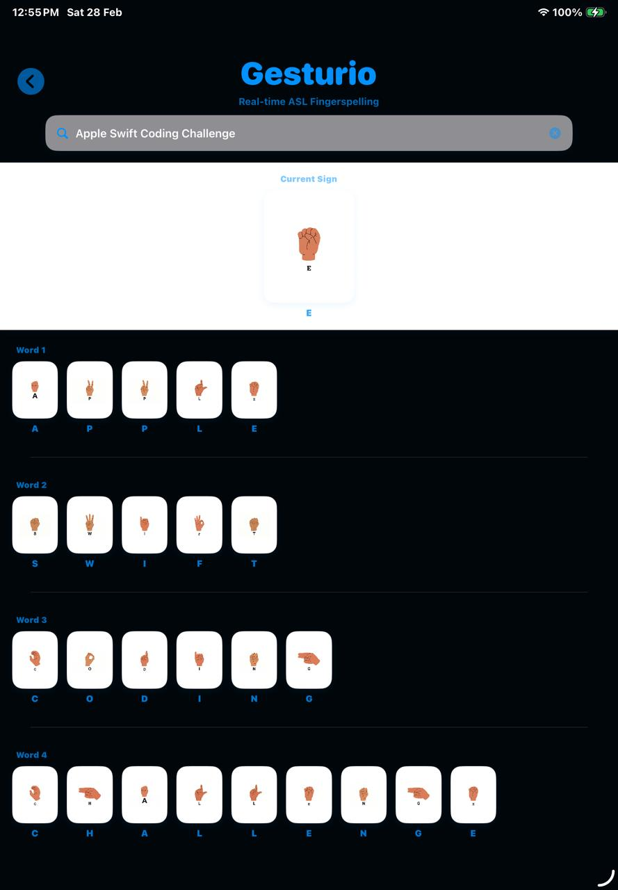

# Gesturio

.png>)

Gesturio is an innovative iOS application designed to facilitate real-time American Sign Language (ASL) translation. Using intuitive gesture recognition, the app helps users learn and communicate through ASL, making sign language accessible and interactive.

## Features

- **Real-time ASL Translation**: Translate ASL gestures into text instantly.
- **Interactive Alphabet Learning**: Explore ASL signs for each letter of the alphabet with visual guides.
- **User-Friendly Interface**: Clean, intuitive design with smooth animations and transitions.
- **Gesture-Based Input**: Supports gesture recognition for seamless interaction.
- **Cross-Device Compatibility**: Optimized for iPhone and iPad, supporting various orientations.

## Screenshots

The following screenshots show Gesturio's main screens:

- **Home Screen**: Clean welcome page with the app logo and a prominent "Let's Start" button. 
- **Fingerspelling View (Hello)**: Text input plus live ASL sign cards for each letter. 
- **Fingerspelling View (Apple Swift Coding Challenge)**: Multi-word translation with each word shown as ASL letter tiles. 


## Requirements

- iOS 18.1 or later
- Xcode 15.0 or later
- Swift 5.9

## Installation

1. Clone the repository:
   ```bash
   git clone https://github.com/yourusername/Gesturi-Swift.git
   cd Gesturi-Swift
   ```

2. Open the project in Xcode:
   - Open `Guestrio.swiftpm` in Xcode.

3. Build and run the app:
   - Select a simulator or connected device.
   - Press `Cmd + R` to build and run.

## Usage

1. Launch the app on your iOS device.
2. On the home screen, tap "Let's Start" to begin.
3. Use the interactive grid to select letters or input gestures.
4. View real-time translations and learn ASL signs.

## Project Structure

- `ContentView.swift`: Main view router and UI components.
- `MyApp.swift`: App entry point.
- `Package.swift`: Swift Package Manager configuration.
- `Assets.xcassets/`: App icons and gesture images.

## Contributing

Contributions are welcome! Please follow these steps:

1. Fork the repository.
2. Create a new branch for your feature: `git checkout -b feature-name`.
3. Make your changes and commit: `git commit -m 'Add some feature'`.
4. Push to the branch: `git push origin feature-name`.
5. Submit a pull request.

## License

This project is licensed under the MIT License - see the [LICENSE](LICENSE) file for details.

## Acknowledgments

- Inspired by the need for accessible communication tools.
- Icons and assets sourced from various free resources.

## Contact

For questions or support, please open an issue on GitHub or contact the maintainers. 
